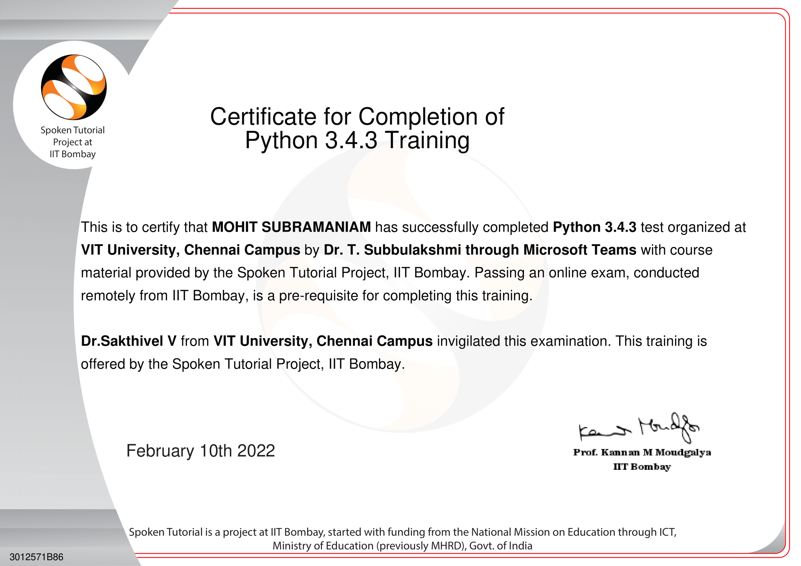
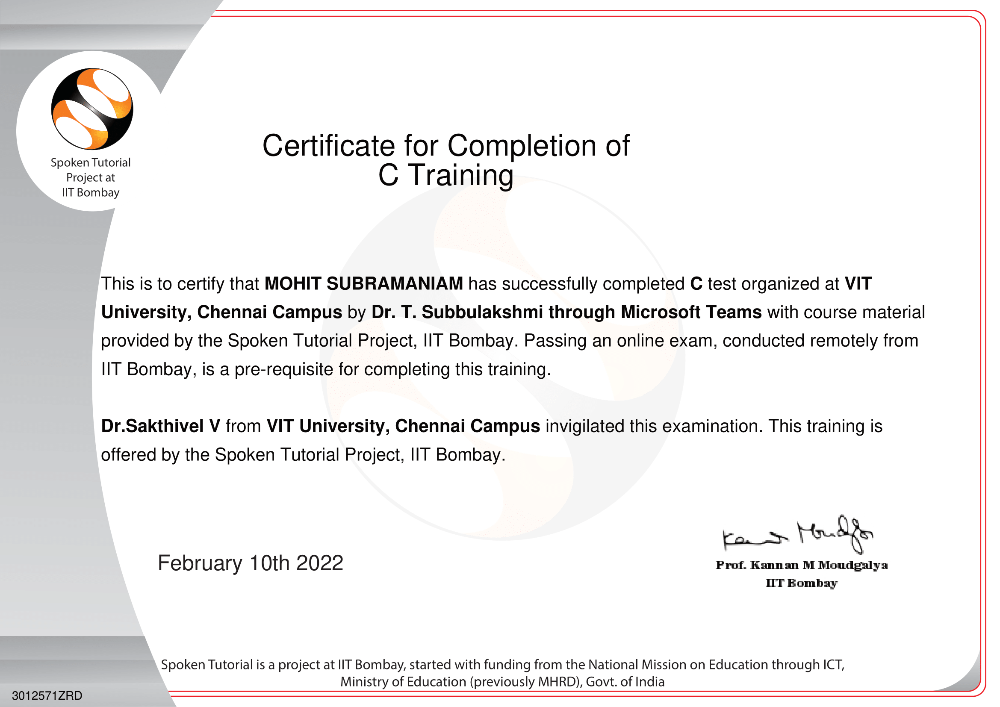
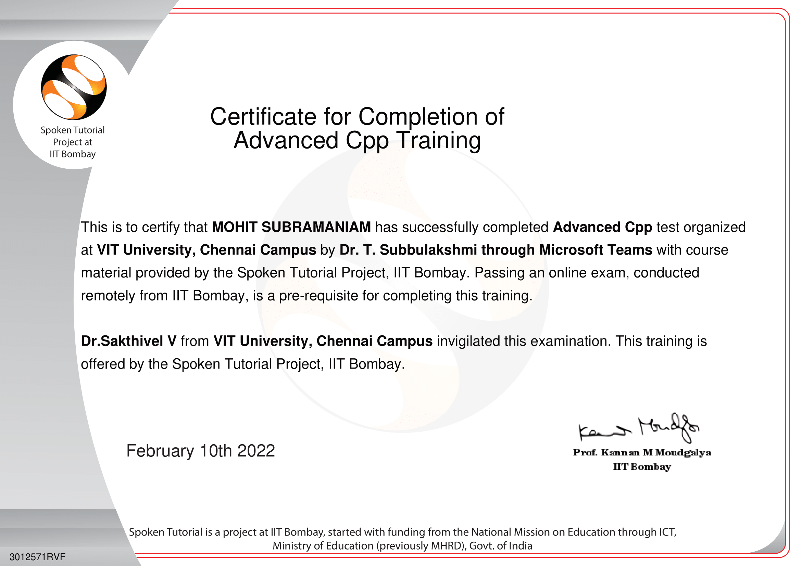
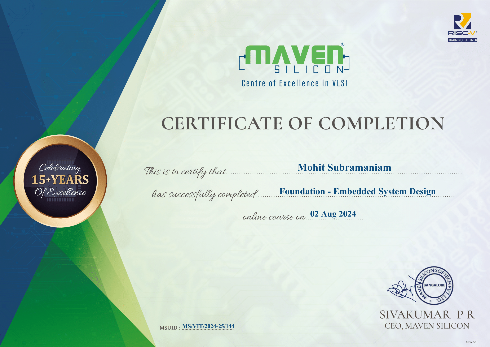
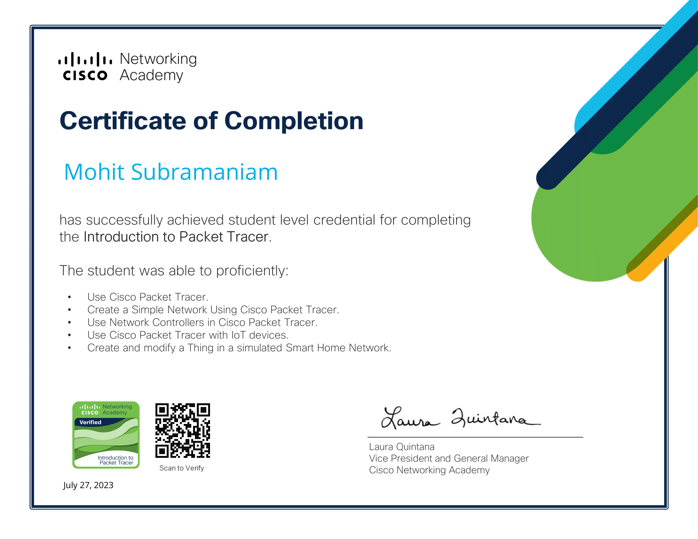
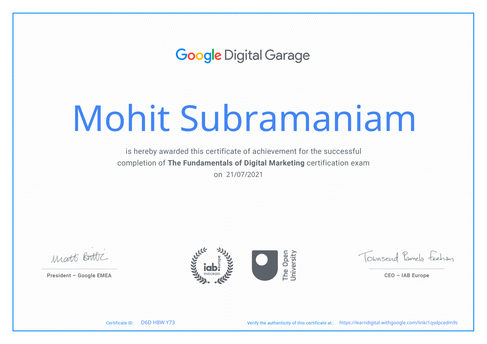
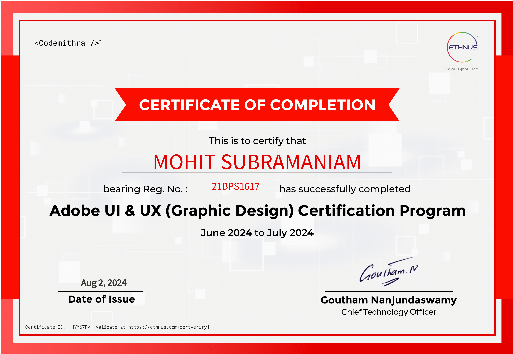
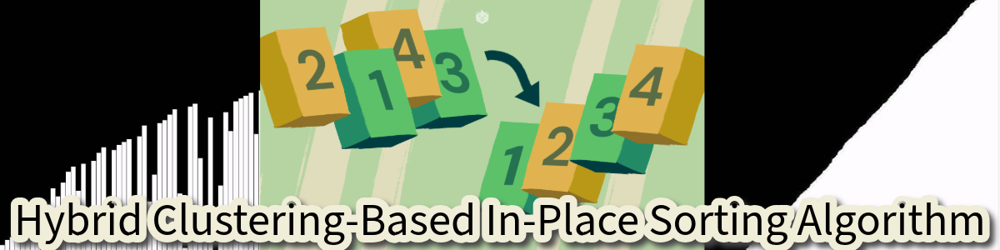

## 👋 About Me
#### Hello, world! 

I'm a B.Tech student at <b>VIT Chennai</b>, specializing in <b>Computer Science Engineering (Cyber-Physical Systems)</b>. I focus on <b>data engineering, cloud computing</b>, and real-time analytics, working with <b>Azure, AWS, GCP, Snowflake, Fabric, and Airflow</b>.
I’ve built scalable ETL pipelines, streaming architectures, and analytical dashboards using tools like Databricks, Power BI, dbt, and Delta Lake.
  

I enjoy playing the guitar 🎸, working on hardware projects 🔧 ([#hobby-projects](https://github.com/mohitsubramaniam15/mohitsubramaniam15/blob/main/README.md#-hobby-projects)), and watching movies 🎬 in my free time. I'm always curious about blending tech and creativity in new ways!

---

## 🧰 Languages and Tools
<table align="center">
  <tr>
    <td align="center">
      
      
      
      
      
      
      
      
      
    </td>
  </tr>
  <tr>
    <td align="center">
      
      
      
      
      
      
      
    </td>
  </tr>
  <tr>
    <td align="center">
      
      
      
    </td>
  </tr>
</table>

#
## 🚀 Featured Projects

#
## 🎓 Education
<table align="center" style="border-radius: 0px; width: 100%; table-layout: fixed;">
  <tr>
    <td align="center" style="padding: 10px;">
      
    </td>
    <td align="center" style="padding: 10px;">
      
    </td>
  </tr>
  <tr>
    <td align="center" style="padding: 10px;"><b>Vellore Institute of Technology, Chennai</b></td>
    <td align="center" style="padding: 10px;"><b>Army Public School, Bangalore</b></td>
  </tr>
  <tr>
    <td align="center" style="padding: 10px;">
      <b>Bachelor of Technology</b> 
      Computer Engineering (Specialization in Cyber Physical Systems) 
      <b>CGPA:</b> 7.89 
      <b>Graduation Year:</b> 2025
    </td>
    <td align="center" style="padding: 10px;">
      <b>Higher Secondary</b> (2021): 85% 
      <b>Secondary</b> (2019): 87.5%
    </td>
  </tr>
</table>

#
## 📜 Certifications

  
  
  
  
  
  
  
  
  
  

---
### 🎨 Hobby-projects
<table align="center" style="border-radius: 0px;"> 
  <tr>
    <td align="center">
      
       
      <b>Hybrid Sorting Algorithm</b>
    </td>
    <td align="center">
      
       
      <b>Password Manager</b>
    </td>
  </tr>
  <tr>
    <td align="center">
      
       
      <b>Smart RC Rescue Rover</b>
    </td>
    <td align="center">
      
       
      <b>Drone for Earthquake Assistance</b>
    </td>
  </tr>
</table>

#
### 🔧 Some extra tools

  
  
  
  
  
  
  

