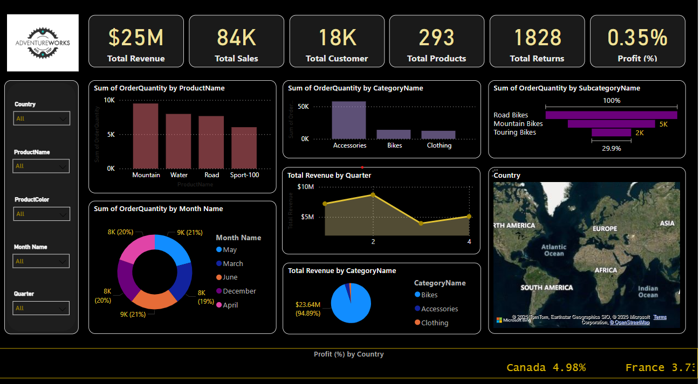
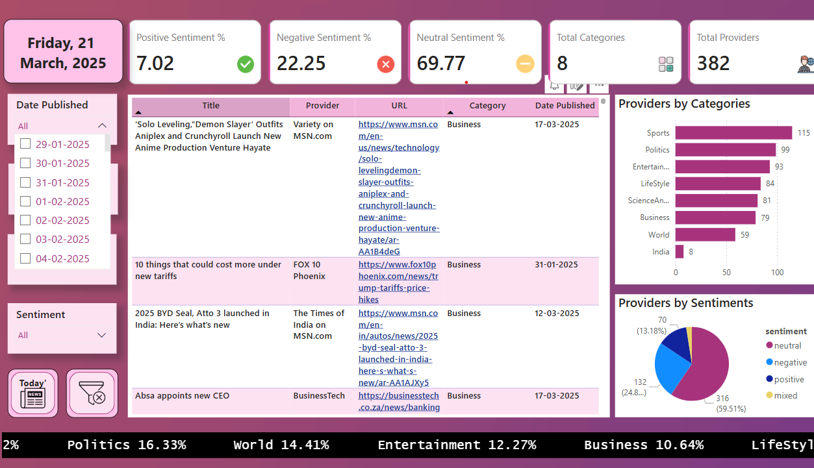
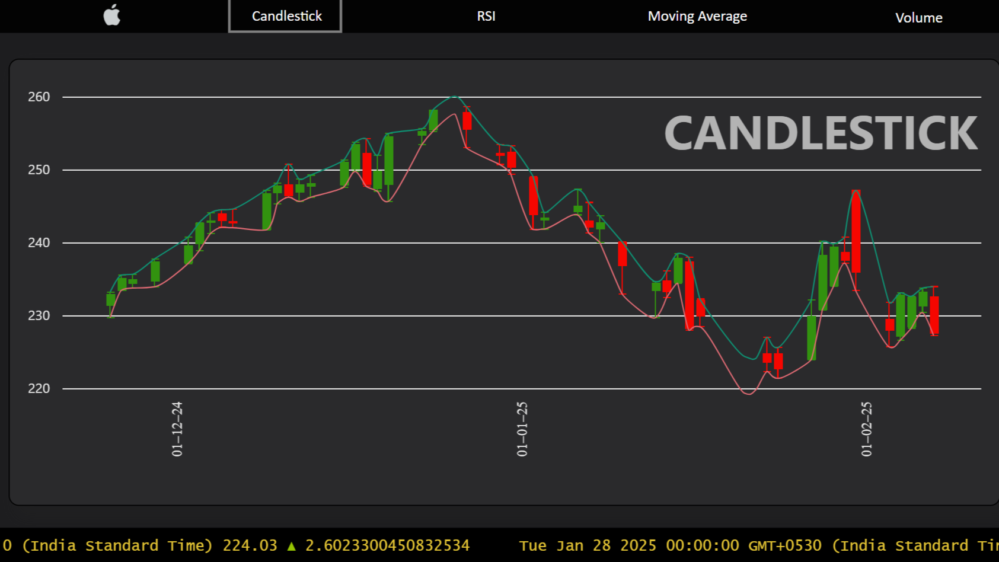
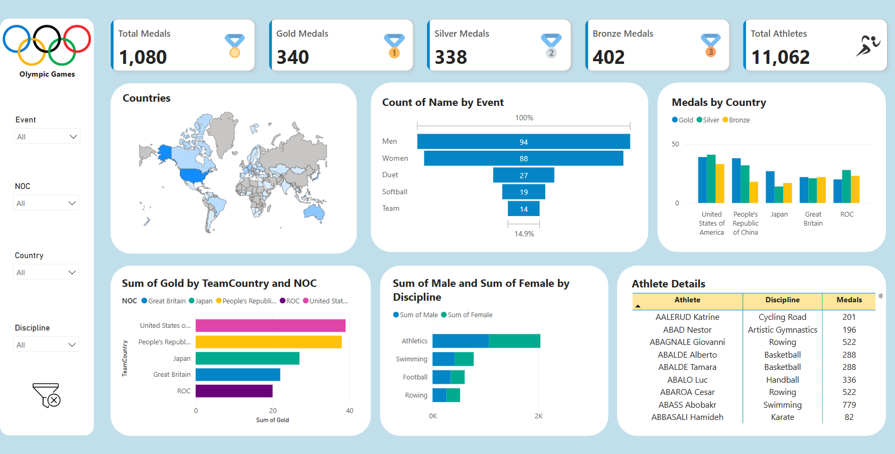
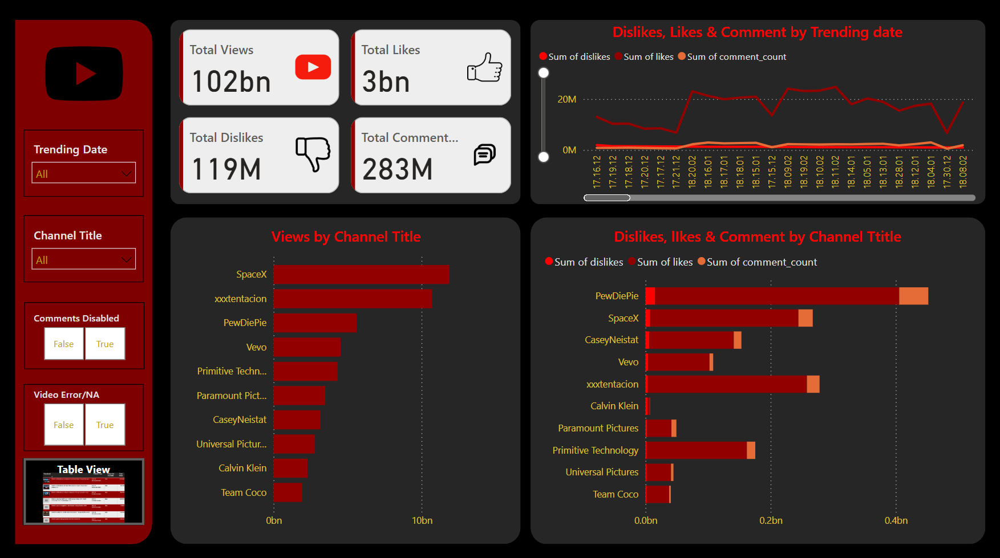
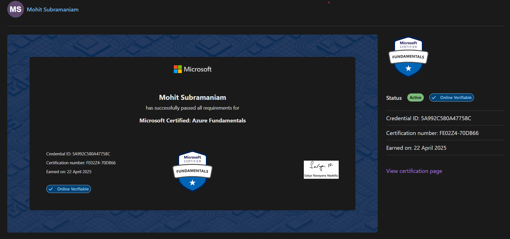

## 👋 About Me
#### Hello, world! 

I'm a B.Tech student at <b>VIT Chennai</b>, specializing in <b>Computer Science Engineering (Cyber-Physical Systems)</b>. I focus on <b>data engineering, cloud computing</b>, and real-time analytics, working with <b>Azure, AWS, GCP, Snowflake, Fabric, and Airflow</b>.
I’ve built scalable ETL pipelines, streaming architectures, and analytical dashboards using tools like Databricks, Power BI, dbt, and Delta Lake.
  

  I enjoy playing the guitar 🎸, working on hardware projects 🔧 (hint: <a href="https://github.com/mohitsubramaniam15/mohitsubramaniam15?tab=readme-ov-file#-hobby-projects">check hobby projects</a>), and watching movies 🎬 in my free time. 

My favourite visualisation tool is <b>PowerBI</b> and I have some experience with EDA and basic ML models.

#
## 📚 IEEE Accepted Journal Paper

<table align="center" style="border-radius: 0px; width: 100%; table-layout: fixed;">
<tr>
    <td align="center">
      
       
      <b>Hybrid Sorting Algorithm</b>
    </td>
  </tr>
</table>

#
## 🚀 Featured Data Projects
<table align="center" style="border-radius: 0px;"> 
  <tr>
    <td align="center">
      
       
      <b>Azure Adventure</b>
       
      End-to-end data pipeline with Azure Data Lake, Databricks, Synapse, and Power BI for advanced analytics.
       
      
        <b>Tech Stack:</b> Azure Data Factory, Azure Data Lake Gen2, Azure Databricks (PySpark), Azure Synapse Analytics, Power BI, CSV, Parquet
      
    </td>
    <td align="center">
      
       
      <b>Fabric News: Real-Time News Analytics with Microsoft Fabric</b>
       
      Real-time news analysis pipeline using Microsoft Fabric for data ingestion, processing, and visualization.
       
      
        <b>Tech Stack:</b> Bing News API, Data Factory, One Lake, Synapse Data Engineering, Synapse Data Science, Power BI, Data Activator, Teams, JSON
      
    </td>
  </tr>
  <tr>
    <td align="center">
      
       
      <b>Azure-Fabric Streaming Analysis</b>
       
      Real-time stock data pipeline using Azure Functions, Event Hubs, and Synapse Analytics.
       
      <b>Tech Stack:</b> Fabric, Azure Event Hubs, Stream Analytics, Synapse, KQL
    </td>
    <td align="center">
      
       
      <b>Azure Olympics-Delta Lake Analysis</b>
       
      Implemented Medallion architecture for Olympic data processing with Delta Lake and Power BI visualization.
       
      <b>Tech Stack:</b> Azure, Databricks, Power BI, DAX, JSON, SQL, PySpark
    </td>
  </tr>
  <tr>
    <td align="center">
      
       
      <b>AWS YouTube Analysis</b>
       
      Built a scalable AWS pipeline for YouTube analytics with S3, Glue, Athena, and QuickSight.
       
      <b>Tech Stack:</b> AWS S3, Glue, Lambda, Athena, QuickSight, CloudWatch
    </td>
    <td align="center">
      
       
      <b>AWS Snowflake Real Estate Analysis</b>
       
      Automated ETL for real estate data using Apache Airflow and Snowflake, with Power BI insights.
       
      <b>Tech Stack:</b> AWS, Apache Airflow, EC2, S3, Snowflake, Power BI, SQL, Python
    </td>
  </tr>
  <tr>
    <td align="center">
      
       
      <b>Retail GCE SODA Analysis</b>
       
      Orchestrated an ETL pipeline with Apache Airflow and BigQuery, ensuring data quality with Soda and dbt.
       
      <b>Tech Stack:</b> Apache Airflow, BigQuery, Soda, dbt, Power BI, SQL, Python
    </td>
    <td align="center">
      
       
      <b>DBT Snowflake Orders Analysis</b>
       
      Designed automated dbt pipelines with Snowflake and Airflow (Astronomer) for optimized data processing.
       
      <b>Tech Stack:</b> dbt, Snowflake, Apache Airflow (Astronomer), SQL, Python, Power BI
    </td>
  </tr>
</table>

---

## 🧰 Languages and Tools
<table align="center">
  <tr>
    <td align="center">
      
      
      
      
      
      
      
      
      
    </td>
  </tr>
  <tr>
    <td align="center">
      
      
      
      
      
      
      
    </td>
  </tr>
  <tr>
    <td align="center">
      
      
      
    </td>
  </tr>
</table>

#
## 🎓 Education
<table align="center" style="border-radius: 0px; width: 100%; table-layout: fixed;">
  <tr>
    <td align="center" style="padding: 10px;">
      
    </td>
    <td align="center" style="padding: 10px;">
      
    </td>
  </tr>
  <tr>
    <td align="center" style="padding: 10px;"><b>Vellore Institute of Technology, Chennai</b></td>
    <td align="center" style="padding: 10px;"><b>Army Public School, Bangalore</b></td>
  </tr>
  <tr>
    <td align="center" style="padding: 10px;">
      <b>Bachelor of Technology</b> 
      Computer Engineering (Specialization in Cyber Physical Systems) 
      <b>CGPA:</b> 7.89 
      <b>Graduation Year:</b> 2025
    </td>
    <td align="center" style="padding: 10px;">
      <b>Higher Secondary</b> (2021): 85% 
      <b>Secondary</b> (2019): 87.5%
    </td>
  </tr>
</table>

---

## 🎨 Hobby-projects
<table align="center" style="border-radius: 0px;"> 
  <tr>
    <td align="center">
      
       
      <b>Smart RC Rescue Rover</b>
    </td>
    <td align="center">
      
       
      <b>Drone for Earthquake Assistance</b>
    </td>
  </tr>
</table>

#
## 📜 Cloud Certifications 

  

#
## 📜 Certificates 

  
  
  
  
  
  
  
  
  
  

