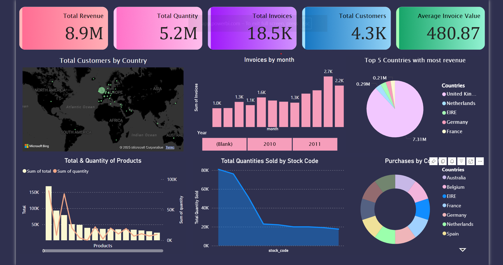
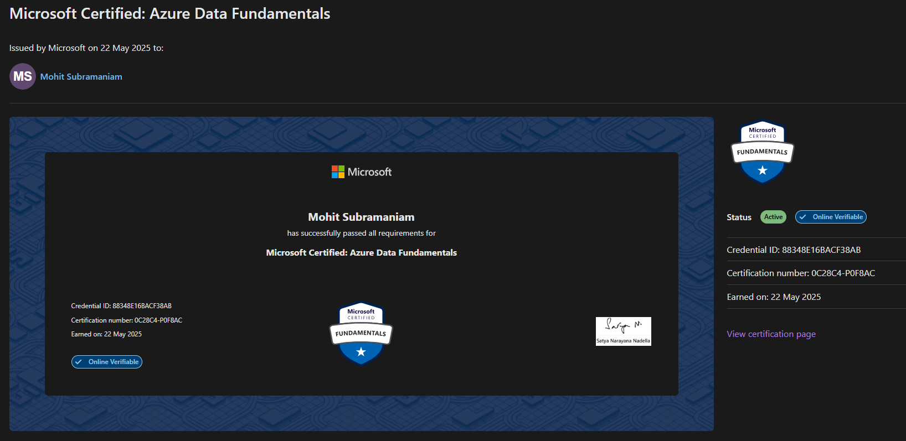

## 👋 Hello, world!

I am a recent <b>Computer Science Engineering (Cyber-Physical Systems)</b> graduate from <b>VIT Chennai</b>, specializing in <b>data engineering and analytics</b>.  
I am a self-taught learner with foundational <b>cloud and data certifications</b>, skilled in <b>SQL, Python, statistics, EDA, and data visualization</b> (10+ dashboards).  
I have hands-on experience building <b>end-to-end data pipelines and real-time architectures</b> across <b>Azure, AWS, and GCP</b>, working with tools such as <b>Snowflake, dbt, Airflow, Power BI, Databricks, and Delta Lake</b>.  

I am also an <a href="https://ieeexplore.ieee.org/document/10976644"><b>IEEE-published author</b></a> for research on performance-driven algorithms.  <a href="https://github.com/mohitsubramaniam15/hybrid_clustering_based_in-place_sorting_algorithm"> Repo for the same.</a>

#
## 📊 Data Analysis 
<table align="center" style="width: 100%; table-layout: fixed; border-collapse: collapse; font-size:16px;">
  <tr>
    <th style="width:45%; font-size:20px;" align="center">Project & Dashboard</th>
    <th style="width:20%; font-size:18px;" align="center">Tech Stack</th>
    <th style="width:35%; font-size:18px;" align="center">Description</th>
  </tr>

  <tr>
    <td align="center" style="width:50%">
      <a href="https://github.com/mohitsubramaniam15/gcp-retail"><b style="font-size:18px;">GCP Retail Validation & Trend Analysis</b></a>
       
      
    </td>
    <td align="left" style="width:20%">
      Google Colab, SQL, Python, Apache Airflow, Google BigQuery, dbt, Soda, Power BI
    </td>
    <td align="justify" style="width:30%">
      Analyzed <b>543K transactions</b> across 8 columns, uncovering revenue trends and top-selling products. Built an interactive dashboard capturing <b>Revenue $8.9M</b>, <b>18.5K invoices</b>, and <b>4.3K customers</b>, providing actionable insights on customer activity and cancellations.
    </td>
  </tr>

  <tr>
    <td align="center" style="width:50%">
      <a href="https://github.com/mohitsubramaniam15/Az-Olympics"><b style="font-size:18px;">Azure Olympics Trend & Comparative Analysis</b></a>
       
      
    </td>
    <td align="left" style="width:20%">
      Azure, Databricks, Colab, Pandas, Seaborn, Matplotlib, Power BI, CSV, Parquet, Delta Lake
    </td>
    <td align="justify" style="width:30%">
      Processed <b>70K+ athlete records</b> with Delta Lake and Databricks. Created dashboards highlighting medal leaders, gender evolution, and decade-wise performance, delivering actionable insights on Olympic trends.
    </td>
  </tr>

  <tr>
    <td align="center" style="width:50%">
      <a href="https://github.com/mohitsubramaniam15/aws-project"><b style="font-size:18px;">AWS YouTube Correlation & Regional Analysis</b></a>
       
      
    </td>
    <td align="left" style="width:20%">
      Python, SQL, Pandas, Seaborn, Matplotlib, Power BI, AWS, Kaggle, Colab
    </td>
    <td align="justify" style="width:30%">
      Transformed <b>22 files</b> across <b>11 regions</b>, analyzing <b>600+ global YouTube channels</b>. Dashboards show <b>102B views</b>, <b>3B likes</b>, <b>283M comments</b>, and <b>119M dislikes</b>, highlighting audience behavior and regional trends.
    </td>
  </tr>

  <tr>
    <td align="center" style="width:50%">
      <a href="https://github.com/mohitsubramaniam15/Aws-sf-RS"><b style="font-size:18px;">AWS Snowflake Real Estate Anomaly & Trend Analysis</b></a>
       
      
    </td>
    <td align="left" style="width:20%">
      SQL, Python, AWS, Apache Airflow, Snowflake, Tableau, Google Sheets, Colab
    </td>
    <td align="justify" style="width:30%">
      Processed <b>9.12M rows</b> from S3 to Snowflake and built a Tableau dashboard on <b>73K+ rows</b> and <b>62 columns</b>, visualizing MoM and YoY trends. Detected anomalies like price spikes, inventory dips, and regional disparities using statistical analysis.
    </td>
  </tr>
</table>

## 🛠️ Data Engineering
<table align="center" style="border-radius: 0px;"> 
  <tr>
    <td align="center">
      
       
      <b>Azure Adventure</b>
       
      End-to-end data pipeline with Azure Data Lake, Databricks, Synapse, and Power BI for advanced analytics.
       
      
        <b>Tech Stack:</b> Azure Data Factory, Azure Data Lake Gen2, Azure Databricks (PySpark), Azure Synapse Analytics, Power BI, CSV, Parquet
      
    </td>
    <td align="center">
      
       
      <b>Fabric News: Real-Time News Analytics with Microsoft Fabric</b>
       
      Real-time news analysis pipeline using Microsoft Fabric for data ingestion, processing, and visualization.
       
      
        <b>Tech Stack:</b> Bing News API, Data Factory, One Lake, Synapse Data Engineering, Synapse Data Science, Power BI, Data Activator, Teams, JSON
      
    </td>
  </tr>
  <tr>
    <td align="center">
      
       
      <b>Azure-Fabric Streaming Analysis</b>
       
      Real-time stock data pipeline using Azure Functions, Event Hubs, and Synapse Analytics.
       
      <b>Tech Stack:</b> Fabric, Azure Event Hubs, Stream Analytics, Synapse, KQL
    </td>
    <td align="center">
      <a href="https://github.com/mohitsubramaniam15/orders_dbt_sf_af">
          <b>DBT Snowflake Orders Analysis</b>
      </a>
       
      Designed automated dbt pipelines with Snowflake and Airflow (Astronomer) for optimized data processing.
       
      <b>Tech Stack:</b> dbt, Snowflake, Apache Airflow (Astronomer), SQL, Python, Power BI
    </td>
  </tr>
</table>

## 🧰 Languages and Tools
<table align="center" style="width: 1000px; border-spacing: 8px;">
  <tr>
    <td align="center">
      
      
      
      
      
      
      
      
      
    </td>
  </tr>
  <tr>
    <td align="center">
      
      
      
      
      
      
      
    </td>
  </tr>
  <tr>
    <td align="center">
      
      
      
    </td>
  </tr>
</table>

## 🎨 Hobby-projects
<table align="center" style="border-radius: 0px; width:95%;">
  <tr>
    <td align="center">
      
       
      <b>Smart RC Rescue Rover</b>
    </td>
    <td align="center">
      
       
      <b>Drone for Earthquake Assistance</b>
    </td>
  </tr>
</table>

## 🧠 Featured AI Projects

|  **Project** | **Description** | **Tech Stack** | **Links** |
|----------------|------------------|----------------|------------|
| 🎧 **Kuku Shorts — AI-Powered Audio Reels** | Gen-AI pipeline that converts books and news into 90-second audio reels. Summarizes long-form text using OpenRouter (DeepSeek LLM), converts to speech with Azure Cognitive Services (TTS), and streams via a Streamlit UI. Built on a 3-layer Bronze–Silver–Gold architecture using Azure Blob and Pipelines for scalable dataflow. | Streamlit, Python, OpenRouter (DeepSeek LLM), Azure Cognitive Services (TTS), Azure Blob Storage, Azure Pipelines | [GitHub](https://github.com/mohitsubramaniam15/KukuDemoShorts) \| [Demo](https://drive.google.com/file/d/13PdKWknrEqy3_nu3DCIeIU_5YBa14KEN/view?usp=sharing) |
| 🙂 **Emotion-Based Music Recommendation** | Classifies emotion from song lyrics using an LSTM model trained on the GoEmotions dataset. Streamlit app recommends Spotify tracks based on detected mood. | TensorFlow (LSTM), Python, Pandas, Streamlit, Spotify API, Scikit-learn, NLP | [GitHub](https://github.com/mohitsubramaniam15/EmotionSongRec) |

## 📜 Cloud Certifications 
### AZ900

  

### DP900

  

