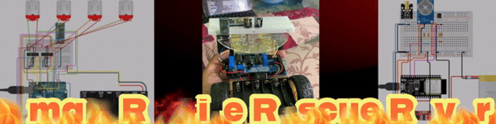

### 👋 About Me
Hello! I'm **Mohit Subramaniam**, a B.Tech student at **Vellore Institute of Technology** (VIT) specializing in **Computer Engineering with Cyber Physical Systems**. I am passionate about building technology-driven solutions and have hands-on experience in embedded systems, automation, software development, and more.

  
         
         

---

### 🧰 Languages and Tools
  

 

#
### 🚀 Featured Projects

    
     
    <b>Hybrid Sorting Algorithm</b>

    
     
    <b>Drone for Earthquake Assistance</b>

    
     
    <b>Smart RC Rescue Rover</b>

    
     
    <b>Password Manager</b>

#
### 🎓 Education
- **Vellore Institute of Technology, Chennai**  
  **Bachelor of Technology** in Computer Engineering (Specialization in Cyber Physical Systems)  
  CGPA: 7.79  
  **Graduation Year:** 2025

- **Army Public School, Bangalore**  
  Higher Secondary (2021): 85%  
  Secondary (2019): 87.5%

#
### 📜 Certifications

  
  
  
  
  
  
  
  
  
  

